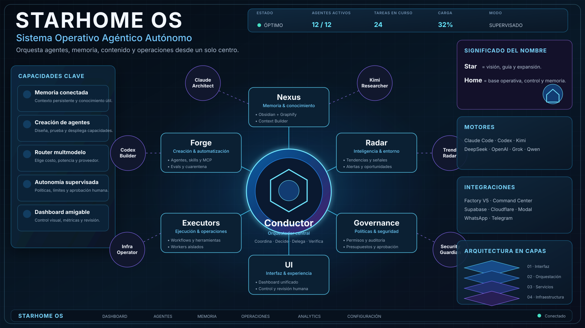

# StarHome OS

**Sistema Operativo Agéntico Autónomo para Cano.**

StarHome OS coordina agentes, Claude Code, Codex, modelos económicos y premium, memoria Obsidian + Graphify, creación de agentes y skills, producción de contenido y conexiones con sistemas externos desde una interfaz central.

> **Nombre del producto:** StarHome OS  
> **Repositorio técnico actual:** `cano-hermes-agentic-os`  
> **Paquete interno foundation:** `cano_hermes`  
> **Estado:** foundation `v0.2.0`



## Significado del nombre

- **Star** representa visión, guía, expansión y la capacidad de descubrir nuevas rutas.
- **Home** representa la base operativa donde viven la memoria, los agentes, las herramientas, los proyectos y el control.
- **OS** expresa que no es solamente un chatbot: es una capa operativa que coordina inteligencia, ejecución, conocimiento y gobierno.

La idea central es: **un hogar inteligente para todo el ecosistema agéntico de Cano, capaz de crecer sin perder control ni memoria.**

## Objetivo

Permitir que Cano solicite resultados de alto nivel —contenido, investigaciones, agentes, automatizaciones, sistemas o revisiones— y que StarHome OS pueda:

1. comprender el objetivo;
2. recuperar contexto relevante;
3. dividir el trabajo;
4. seleccionar agentes, modelos y herramientas;
5. construir, probar y revisar entregables;
6. registrar decisiones, costos y aprendizajes;
7. solicitar aprobación antes de acciones sensibles;
8. mejorar procesos mediante evaluaciones y memoria supervisada.

## Arquitectura principal

```text
Cano
  ↓
StarHome Gateway / Dashboard
  ↓
Conductor + Task Engine + Governance
  ↓
Model Router + Capability Registry
  ↓
Claude Code · Codex · Kimi · DeepSeek · Qwen · Grok · OpenAI · Local
  ↓
Engineering · Research · Content · Forge · Operations
  ↓
Nexus: Obsidian + Graphify + Context Builder
  ↓
Factory V5 · Command Center · Supabase · Cloudflare · Modal
```

## Núcleos de StarHome OS

### Conductor

Interpreta objetivos, divide tareas, elige equipos y supervisa resultados. No ejecuta directamente el trabajo especializado.

### Nexus

Memoria conectada mediante Markdown/Obsidian, Graphify y un Context Builder que entrega únicamente el contexto necesario a cada agente.

### Forge

Fábrica de agentes, skills, MCP, blueprints, evaluaciones y contenedores. Las capacidades nuevas empiezan en cuarentena.

### Radar

Detecta tendencias, señales, oportunidades, métricas y cambios relevantes para investigación, contenido y operación.

### Executors

Ejecuta tareas mediante Claude Code, Codex, Hermes Agent, OpenClaw, navegador, Python y workers aislados.

### Governance

Controla permisos, presupuestos, aprobaciones, trazabilidad, seguridad, límites y acciones sensibles.

### UI

Dashboard central para conversar, revisar agentes, modificar tareas, aprobar operaciones, consultar Nexus y observar métricas.

## Componentes incluidos

- API FastAPI y dashboard web;
- tareas, eventos y aprobaciones persistentes en SQLite;
- Conductor ligero y Task Governor;
- router multmodelo con estrategia `subscription-first`;
- perfiles para Claude Code, Codex, Hermes Agent y OpenClaw;
- registro de capacidades, agentes, skills y herramientas;
- 38 agentes organizados por equipos;
- 40 skills reutilizables;
- Nexus Markdown/Obsidian con grafo y contexto compacto;
- Agent Forge y Skill Forge;
- Radar y Content OS;
- adaptadores separados para Factory V5 y Cano AI Command Center;
- gobierno de permisos, presupuestos, aprobaciones y auditoría;
- estructura Docker, Ubuntu y systemd;
- documentación de arquitectura, seguridad, privacidad, roadmap y operación.

## Principios de seguridad

- ninguna clave se almacena en Git;
- producción, publicación, gasto, mensajes y despliegues requieren aprobación;
- los agentes no reciben acceso al socket de Docker;
- Claude Code y Codex trabajan en espacios separados;
- capacidades importadas comienzan en cuarentena;
- las escrituras de memoria se promueven de forma supervisada;
- los proveedores externos están desactivados hasta configurarse explícitamente;
- el repositorio no debe contener datos personales ni configuración productiva.

Consulta [SECURITY.md](SECURITY.md) y [PRIVACY.md](PRIVACY.md).

## Estructura

```text
cano_hermes/       núcleo, API, router, Nexus y Forge
agents/            manifiestos de agentes
skills/            skills reutilizables
integrations/      contratos con sistemas externos
docs/              arquitectura, marca, seguridad y operación
docs/assets/       diagramas e identidad visual
vault/             estructura base de Obsidian
infrastructure/    Docker, Ubuntu y systemd
scripts/           utilidades administrativas
tests/             pruebas incluidas en el proyecto
```

## Configuración local

```bash
python3 -m venv .venv
. .venv/bin/activate
pip install -e '.[dev]'
cp .env.example .env
uvicorn cano_hermes.api.app:app --reload
```

Dashboard local:

```text
http://127.0.0.1:8000
```

## Estado de integraciones

| Capacidad | Estado inicial |
|---|---|
| API y dashboard | Construido |
| Tareas y eventos SQLite | Construido |
| Registro de agentes y skills | Construido |
| Nexus Markdown/Obsidian | Construido |
| Claude Code | Adaptador seguro; requiere autenticación local |
| Codex | Adaptador seguro; requiere autenticación local |
| Kimi, DeepSeek, Qwen, Grok y OpenAI | Requieren claves y presupuesto |
| Factory V5 | Contrato externo; sin activación productiva |
| Command Center | Sistema externo; no absorbido |
| Publicación y despliegue | Bloqueados por defecto |

## Documentación

- [Arquitectura](docs/ARCHITECTURE.md)
- [Identidad y nombre](docs/BRAND.md)
- [Seguridad](docs/SECURITY.md)
- [Roadmap](ROADMAP.md)
- [Reglas de agentes](AGENTS.md)
- [Instrucciones para Claude Code](CLAUDE.md)
- [Privacidad](PRIVACY.md)
- [Contribución](CONTRIBUTING.md)

## Licencia

Este repositorio utiliza una licencia propietaria. Consulta [LICENSE](LICENSE). La visibilidad pública del repositorio no concede permiso para copiar, redistribuir, vender o reutilizar el código.

---

**Producto:** StarHome OS  
**Propietario:** Cano / `syacreator09-sys`  
**Repositorio:** `cano-hermes-agentic-os`  
**Versión de foundation:** `0.2.0`
